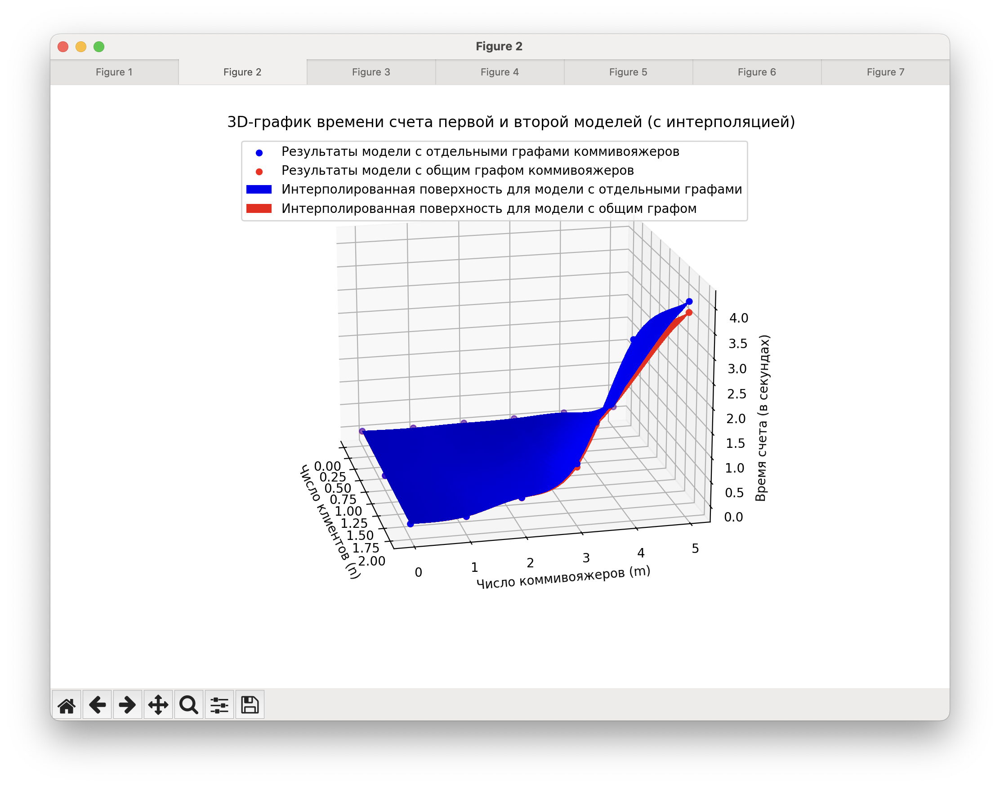
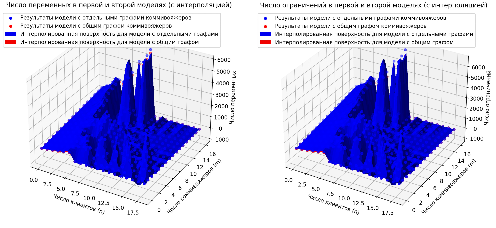
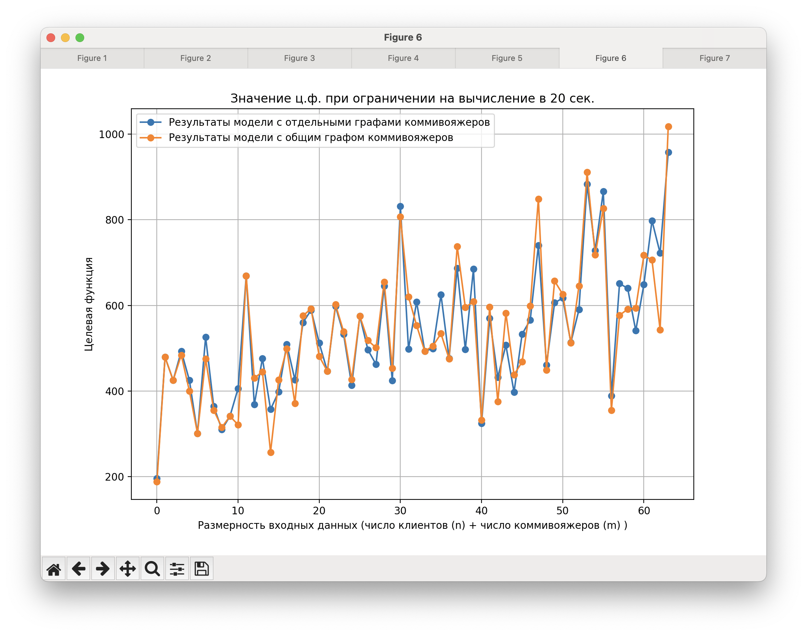
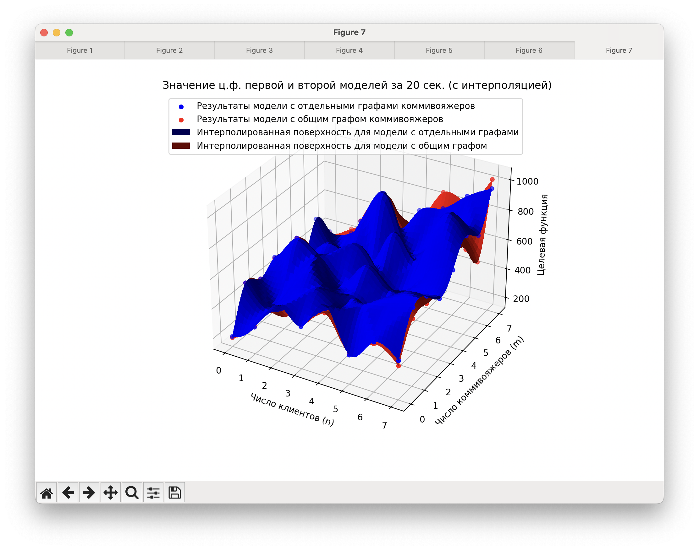

# Дз №7

`Сазонова Ася` и `Крестьянинов Саша` `ПМ-2101`

### Обзор:

1. [Изначальная модель mTSPTW](./models/base_model.py)
2. [Описание сокращенной модели](./refs/short_model.pdf)
2. [Сокращенная модель mTSPTW](./models/updated_model.py)

### Анализ:

С ростом n (число клиентов) и m (число коммивояжеров) на произвольно сгенирированных данных 
время счета растет похожим на экспоненту образом, уже при достаточно маленьких размеров задачи (n = m = 7)
трудно дождаться момента когда модель сойдется к решению.

График зависимости времени счета от объединенных входных данных задачи (m + n)

И график зависимости времени счета от входных данных задачи, где входные размерности заданы по осям
(добавили интерполяцию т.к. шаг там большой выходит и очень рубленная поверхность выходила без нее)

Если построить графики зависимости количества переменных и ограничений от размера входных данных, получается примерно такая картина:

Точки обеих поверхностей близки друг к другу, но значения для первой модели (с использованием m графов) больше чем для второй модели.

Числу ограничений 0 соответствует ситуация когда модель не смогла найти допустимое решение. Видно, что начиная с 
некоторого момента (~ с n=6) это начинает происходить все чаще, и зависит в большей мере от количества клиентов (и, вероятно, их временных окон) 
чем от числа коммивояжеров. (2d график не приводим, из-за частых занулений он слабочитаемый)

Для бОльших значений n и m использовали вариант с ограничением по времени на поиск решения моделью.
Ниже график найденного значения целевой функции в зависимости от входных данных при ограничении в 20 секунд.

И 3d версия с n и m по осям

Видно, что при таком ограничении по времени вторая модель часто справляется лучше первой (ц.ф. на минимум, меньше=лучше), 
однако не на всех тестах это так.